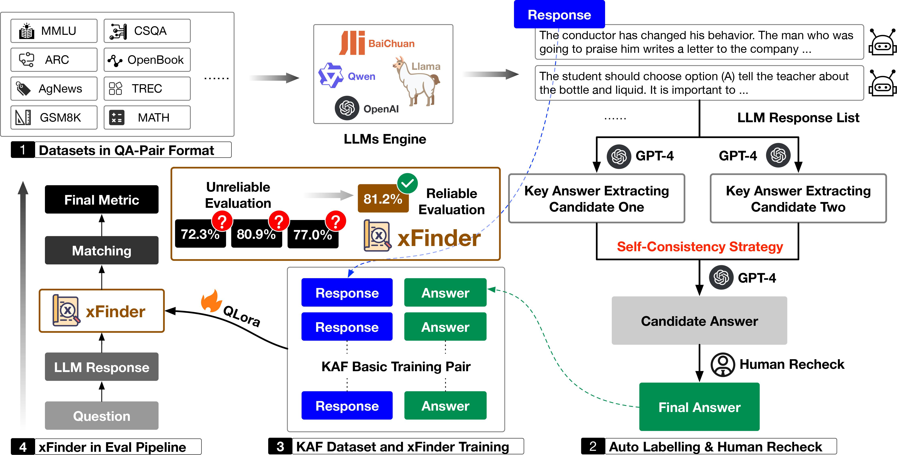
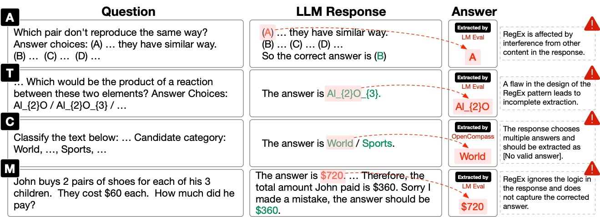
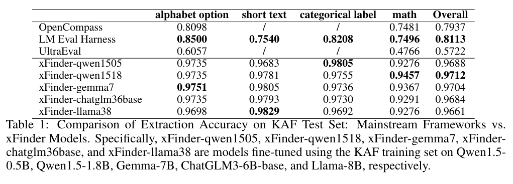
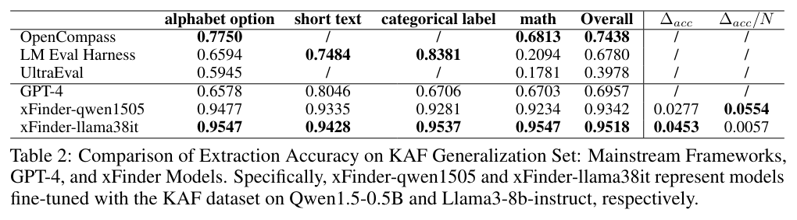

<div align="center"><h2>
xFinder: Robust and Pinpoint Answer Extraction for Large Language Models</h2></div>

<p align="center">
    <!-- arxiv badges -->
    <a href="https://arxiv.org/abs/2405.11874">
        
    </a>
    <!-- Github -->
    <a href="https://github.com/IAAR-Shanghai/xFinder">
        
    </a>
    <!-- hf collection -->
    <a href="https://huggingface.co/collections/IAAR-Shanghai/xfinder-664b7b21e94e9a93f25a8412"></a>
    <!-- Model 0.5B -->
    <a href="https://huggingface.co/IAAR-Shanghai/xFinder-qwen1505">
        
    </a>
    <a href="https://huggingface.co/IAAR-Shanghai/xFinder-llama38it">
        
    </a>
</p>

<div align="center">
    <p>
        <a href="https://github.com/Duguce">Qingchen Yu</a><sup>1,*</sup>, 
        <a href="https://github.com/fan2goa1">Zifan Zheng</a><sup>1,*</sup>, 
        <a href="https://github.com/Ki-Seki">Shichao Song</a><sup>2,*</sup>, 
        <a>Zhiyu Li</a><sup>1,†</sup>, Feiyu Xiong<sup>1</sup>, Bo Tang<sup>1</sup>, <a href="https://github.com/hush-cd">Ding Chen</a><sup>1</sup>
    </p>
    <p>
        <sup>1</sup><a href="https://www.iaar.ac.cn/">Institute for Advanced Algorithms Research, Shanghai</a>, <sup>2</sup><a href="https://en.ruc.edu.cn/">Renmin University of China</a>
    </p>
</div>


<div align="center"><h5>For business inquiries, please contact us at <a href="mailto:lizy@iaar.ac.cn">lizy@iaar.ac.cn</a>.</h5></div>


**🎯 Who Should Pay Attention to Our Work?**

- **If you are developing a Benchmark**, you can use our xFinder to replace traditional RegEx methods for extracting key answers from LLM responses. This will help you improve the accuracy of your evaluation results, enabling more reliable and meaningful comparisons and validation of model performance.
- **If you are a designer of evaluation frameworks**, you can integrate our xFinder into your framework's answer extraction component to enhance the robustness and reliability of the evaluation process.

> \[!IMPORTANT\]
>
> 🌟 **Star Us!** By starring our project on GitHub, you'll receive all release notifications instantly. We appreciate your support!

## :loudspeaker: News
- **[2024/08]** We updated xFinder: The [model](https://huggingface.co/collections/IAAR-Shanghai/xfinder-664b7b21e94e9a93f25a8412) now supports processing both English and Chinese.
- **[2024/05]** We released xFinder: Robust and Pinpoint Answer Extraction for Large Language Models. Check out the [paper](https://arxiv.org/abs/2405.11874).

## :sparkles: Overview
<div align="center">
    
</div>

<details><summary>Abstract</summary>
The continuous advancement of large language models (LLMs) has brought increasing attention to the critical issue of developing fair and reliable methods for evaluating their performance. Particularly, the emergence of subjective or non-subjective cheating phenomena, such as test set leakage and prompt format overfitting, poses significant challenges to the reliable evaluation of LLMs. Since evaluation frameworks often utilize Regular Expression (RegEx) for answer extraction, some models may adjust their responses to comply with specific formats that are easily extractable by RegEx. Nevertheless, the key answer extraction module based on RegEx frequently suffers from extraction errors. This paper conducts a comprehensive analysis of the entire LLM evaluation chain, demonstrating that optimizing the key answer extraction module can improve extraction accuracy, reduce LLMs' reliance on specific answer formats, and enhance the reliability of LLM evaluation. To address these issues, we propose xFinder, a model specifically designed for key answer extraction. As part of this process, we create a specialized dataset, the Key Answer Finder (KAF) dataset, to ensure effective model training and evaluation. Through generalization testing and evaluation in real-world scenarios, the results demonstrate that the smallest xFinder model with only 500 million parameters achieves an average answer extraction accuracy of 93.42%. In contrast, RegEx accuracy in the best evaluation framework is 74.38%. xFinder exhibits stronger robustness and higher accuracy compared to existing evaluation frameworks.
</details>

We summarize our primary contributions as follows:

- We provide a comprehensive review of LLM evaluation processes in the industry, identifying critical factors that can lead to unreliable evaluation results.
- We introduce xFinder, a model specifically designed for key answer extraction. The KAF dataset supports its effective training and evaluation.
- In our extensive experiments, we demonstrate that RegEx-based evaluation methods are unreliable, while our xFinder model significantly improves reliability.

<div align="center">
    
</div>

> As shown in the figure, instances where evaluation frameworks such as LM Eval Harness and OpenCompass failed to extract key answers are illustrated. Specifically, A/T/C/M represent tasks with alphabet / short text / categorical label / math options, respectively.

## :zap: Quick Start
1. **Ensure Compatibility**: Ensure you have Python 3.10.0+.
2. **Create Benchmark Dataset**: To facilitate the evaluation of benchmark datasets using xFinder, we have standardized various mainstream benchmark datasets into a unified JSON format. For details, see [create_benchmark_dataset.py](./scripts/dataset_construction/create_benchmark_dataset.py). Additionally, if you want to use xFinder to evaluate your own datasets, you can refer to the provided script template [benchmark_dataset_template.py](./scripts/dataset_construction/benchmark_dataset_template.py) for format conversion.
3. **Prepare QA pairs & LLM Outputs**: Prepare the LLM outputs that you want to evaluate. 
   - provide a `.json` file including original question, key answer type (alphabet / short_text / categorical_label / math), LLM output, standard answer range.
   - For a detailed example of the expected format, refer to [`demo/example.json`](demo/example.json).
4. **Deploy the xFinder Model**: Choose between two models for deployment, [xFinder-qwen1505](https://huggingface.co/IAAR-Shanghai/xFinder-qwen1505) or [xFinder-llama38it](https://huggingface.co/IAAR-Shanghai/xFinder-llama38it).

- ## :zap: Quick Start
1. **Ensure Compatibility**: Ensure you have Python 3.10.0+.
2. **Create Benchmark Dataset**: To facilitate the evaluation of benchmark datasets using xFinder, we have standardized various mainstream benchmark datasets into a unified JSON format. For details, see [create_benchmark_dataset.py](./scripts/dataset_construction/create_benchmark_dataset.py). Additionally, if you want to use xFinder to evaluate your own datasets, you can refer to the provided script template [benchmark_dataset_template.py](./scripts/dataset_construction/benchmark_dataset_template.py) for format conversion.
3. **Prepare QA pairs & LLM Outputs**: Prepare the LLM outputs that you want to evaluate. 
   - provide a `.json` file including original question, key answer type (alphabet / short_text / categorical_label / math), LLM output, standard answer range.
   - For a detailed example of the expected format, refer to [`demo/example.json`](demo/example.json).
4. **Deploy the xFinder Model**: Choose between two models for deployment, [xFinder-qwen1505](https://huggingface.co/IAAR-Shanghai/xFinder-qwen1505) or [xFinder-llama38it](https://huggingface.co/IAAR-Shanghai/xFinder-llama38it).

```
conda create -n xfinder_env python=3.10 -y
conda activate xfinder_env
pip install xfinder
```

<details> <summary>Evaluating a Single Question</summary>
To evaluate a single QA pair using the Evaluator class, follow the example code below. This demonstrates how to initialize the Evaluator and evaluate a sample question.

```
from xfinder.modules.eval import Evaluator

# Initialize the Evaluator instance
evaluator = Evaluator(
    model_name="xFinder-qwen1505",       # Model name for inference
    inference_mode="local",              # Inference mode ('local' or 'api')
    model_path_or_url="IAAR-Shanghai/xFinder-qwen1505",  # Path or URL of the model
)

# Define a single evaluation question
question = "What is the capital of France?"
llm_output = "The capital of France is Paris."
standard_answer_range = ["Paris", "Lyon", "Marseille"]  # Acceptable answers
key_answer_type = "short_text"                          # Answer type
correct_answer = "Paris"

# Evaluate the single question
result = evaluator.evaluate_single_example(
    question,
    llm_output,
    standard_answer_range,
    key_answer_type,
    correct_answer
)
print(f"Single example evaluation result: {result}")
```
</details> 

<details> <summary>Evaluating an Entire Dataset</summary>
To evaluate multiple QA pairs, you can use a dataset formatted as a JSON file. Below is an example demonstrating how to evaluate an entire dataset.

```
from xfinder.modules.eval import Evaluator
import importlib.resources as pkg_resources
from xfinder import examples

# Initialize the Evaluator instance
evaluator = Evaluator(
    model_name="xFinder-qwen1505",
    inference_mode="local",
    model_path_or_url="IAAR-Shanghai/xFinder-qwen1505",
)

# Evaluate the entire dataset
data_path = "/data/to/path/dataset.json"
accuracy = evaluator.evaluate(data_path)
print(f"Accuracy for the dataset: {accuracy}")
```
</details>

Note: We provide scripts for fine-tuning xFinder in [xfinder_training](./scripts/xfinder_training/).

## :sun_with_face: Examples: RegEx vs. xFinder
We demonstrate instances across four types of questions where RegEx fails to extract or frequently extracts incorrect answers, whereas xFinder accurately extracts the key answers.
```
{
    "key_answer_type": "alphabet option",
    "question": "A man is seen playing guitar on a stage with others playing instruments behind him. The man grabs a guitar from the audience and begins playing both one after the other ...",
    "llm_output": "Option A is the correct choice as it describes ...",
    "standard_answer_range": "[['A', 'strums the guitar in the end, continues playing the guitar with the crowd following him as well as lining up next to him.'], ['B', 'continues playing the instruments and ends by waving to the crowd and walking off stage.'], ['C', 'then turns to the audience and gives a stuffed toy to the audience and continues playing.'], ['D', 'finally stops playing and moves his hands for the crowd to see.']]",
    "gold_label": "A",
    "xFinder_output": "A",
},
{
    "key_answer_type": "short text",
    "question": "If you really wanted a grape, where would you go to get it? Answer Choices: winery / fruit stand / field / kitchen / food",
    "llm_output": "The answer is winery / fruit stand / field / kitchen / food ...",
    "standard_answer_range": "[\"winery\", \"fruit stand\", \"field\", \"kitchen\", \"food\"]",
    "gold_label": "[No valid answer]",
    "xFinder_output": "[No valid answer]",
},
{
    "key_answer_type": "categorical label",
    "question": "How tall is the Sears Building ?",
    "llm_output": "The Sears Building is a specific structure, so the answer would be a Location ...",
    "standard_answer_range": "['Abbreviation', 'Entity', 'Description', 'Person', 'Location', 'Number']",
    "gold_label": "Location",
    "xFinder_output": "Location",
},
{
    "key_answer_type": "math",
    "question": " Mike made 69 dollars mowing lawns over the summer. If he spent 24 dollars buying new mower blades, how many 5 dollar games could he buy with the money he had left? ",
    "llm_output": "To find out how many 5 dollar ... Let's calculate that:\n\n$45 / $5 = 9\n\nSo, Mike could buy 9 5 dollar games with the money he had left.",
    "standard_answer_range": "a(n) number / set / vector / matrix / interval / expression / function / equation / inequality",
    "gold_label": "9",
    "xFinder_output": "9",
}
```
## :trophy: Results of Extraction Accuracy
**Baseline**: OpenCompass, LM Eval Harness, UltraEval, GPT-4.
**Our Method**: xFinder-qwen1505, xFinder-qwen1518, xFinder-gemma7, xFinder-chatglm36base, xFinder-llama38, xFinder-llama38it.

We evaluated their accuracy in extracting key answers from both the KAF test set and generalization sets. The metric in the table is accuracy.
<div align="center">
    
</div>
<div align="center">
    
</div>

## :memo: Citation
```
@article{xFinder,
      title={xFinder: Robust and Pinpoint Answer Extraction for Large Language Models}, 
      author={Qingchen Yu and Zifan Zheng and Shichao Song and Zhiyu Li and Feiyu Xiong and Bo Tang and Ding Chen},
      journal={arXiv preprint arXiv:2405.11874},
      year={2024},
}
```

## :triangular_flag_on_post: TODOs
<details><summary>Click me to show all TODOs</summary>

- [ ] feat: customized configuration on attributes' names.
- [ ] feat: support quick replacement of RegEx in OpenCompass. 
- [ ] feat: support parallel (or offline batched) evaluation.
- [ ] feat: demo deployment.
- [ ] feat: API deployment.
- [ ] codes: upload data construction pipeline codes.
- [ ] docs: add video tutorial.

</details>

## :star: Star Trends

<a href="https://star-history.com/#IAAR-Shanghai/xFinder&Date">
 <picture>
   <source media="(prefers-color-scheme: dark)" srcset="https://api.star-history.com/svg?repos=IAAR-Shanghai/xFinder&type=Date&theme=dark" />
   <source media="(prefers-color-scheme: light)" srcset="https://api.star-history.com/svg?repos=IAAR-Shanghai/xFinder&type=Date" />
   
 </picture>
</a>

<p align="right"><a href="#top">🔝Back to top</a></p>