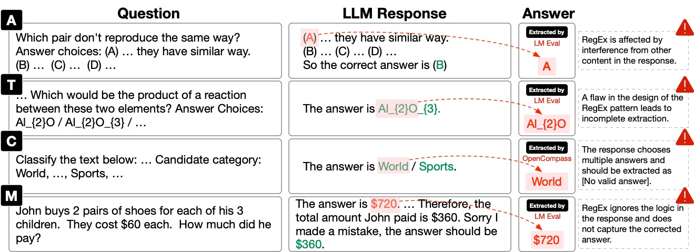
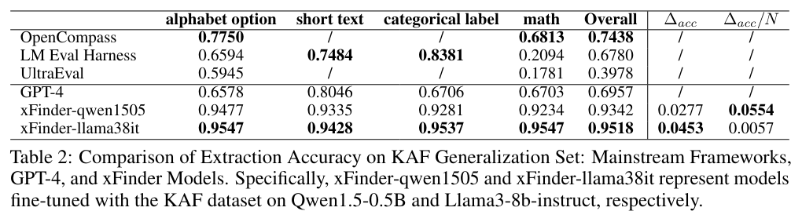

<div align="center"><h2>
xFinder: Robust and Pinpoint Answer Extraction for Large Language Models</h2></div>

<p align="center">
    <!-- arxiv badges -->
    <a href="https://arxiv.org/abs/2405.11874">
        
    </a>
    <!-- Github -->
    <a href="https://github.com/IAAR-Shanghai/xFinder">
        
    </a>
    <!-- hf collection -->
    <a href="https://huggingface.co/collections/IAAR-Shanghai/xfinder-664b7b21e94e9a93f25a8412"></a>
    <!-- Model 0.5B -->
    <a href="https://huggingface.co/IAAR-Shanghai/xFinder-qwen1505">
        
    </a>
    <a href="https://huggingface.co/IAAR-Shanghai/xFinder-llama38it">
        
    </a>
</p>

<div align="center">
    <p>
        <a href="https://github.com/Duguce">Qingchen Yu</a><sup>1,*</sup>, 
        <a href="https://github.com/fan2goa1">Zifan Zheng</a><sup>1,*</sup>, 
        <a href="https://github.com/Ki-Seki">Shichao Song</a><sup>2,*</sup>, 
        <a>Zhiyu Li</a><sup>1,†</sup>, Feiyu Xiong<sup>1</sup>, Bo Tang<sup>1</sup>, <a href="https://github.com/hush-cd">Ding Chen</a><sup>1</sup>
    </p>
    <p>
        <sup>1</sup><a href="https://www.iaar.ac.cn/">Institute for Advanced Algorithms Research, Shanghai</a>, <sup>2</sup><a href="https://en.ruc.edu.cn/">Renmin University of China</a>
    </p>
</div>


<div align="center"><h5>For business inquiries, please contact us at <a href="mailto:lizy@iaar.ac.cn">lizy@iaar.ac.cn</a>.</h5></div>

<div align="center">

[English](README.md) | 简体中文

</div>

> \[!IMPORTANT\]
>
> 🌟 **Star Us!** 通过在GitHub上star我们的项目，您可以收到本项目的所有更新信息和内容。感谢您的支持！

## :loudspeaker: 更新
- **[2024/08]** 我们更新了xFinder：现在[模型](https://huggingface.co/collections/IAAR-Shanghai/xfinder-664b7b21e94e9a93f25a8412)支持同时处理英文和中文
- **[2024/05]** 我们发布了论文xFinder: Robust and Pinpoint Answer Extraction for Large Language Models。具体内容请阅读[论文](https://arxiv.org/abs/2405.11874).

## :sparkles: 总览
<div align="center">
    
</div>

<details><summary>摘要</summary>
随着large language model (LLM)的不断发展，如何更加公平、可信的评估大模型的性能表现已经成为了非常值得关注的热点问题之一。特别是伴随着测试集泄露、Prompt格式过拟合等主观或非主观作弊现象的出现，给大语言模型的可信评估带来了极大的挑战。由于以往评估框架往往会使用Regular Expression（RegEx）进行答案的抽取，因此为了提高评估效果，部分模型会针对测试集合的答案格式进行特殊指令拟合，以提高正确率。然而，有研究表明这种拟合对模型的泛化性有较大的影响，导致在回答真实世界问题的时候表现较差。在本文中，我们首次对llm evaluation的全链条进行了薄弱点分析，并发现通过优化"关键答案提取"模块能够提高模型评估的可靠性，降低大语言模型训练过程中对于特定答案格式的依赖，提高抽取准确率。此外，我们发现针对同一问题泛化出不同类型的问答形式可以有效降低作弊的可能性。基于此，我们结合自动标注和人工标注的方法制作了一个关键答案提取数据集，称为Key Answer Extraction (KAE) dataset。接着，我们设计并实现了一个名为xFinder的模型，专门用于从数据集中提取关键答案。通过泛化测试和真实场景下的评估，结果显示KAE数据集的质量极高，且我们微调的最小的xFinder为0.5B，在泛化测试集上的答案提取准确率也达到了93.42%，表现优于当前流行的评估框架，展现出更强的鲁棒性。这标志着我们对现有评估框架进行更新和改进的初步尝试。
</details>

在这项工作中，我们的贡献总结如下：
- 本研究首次对业界的评估流程进行了全面梳理，分析了其中可能导致评估结果不可靠的关键因素。

- 我们构建了KAF微调数据集，并利用它训练了xFinder模型，该模型旨解决传统评估框架中的正则提取器组件难以提取key answer的问题。

- 通过广泛的实验，包括微调有效性实验，泛化性实验，以及将组件放在真实世界中参与评测的实验，我们发现：现有的评估方式其可靠性的确较差，我们的xFinder能够很好地改善可靠性。

<div align="center">
    
</div>

> 如图所示，这是一些评估框架如LM Eval Harness和OpenCompass未能正确提取到关键答案的实例。具体而言，A/T/C/M分别代表带字母题/短文本题/分类标签题/数学题。

## :zap: 快速上手
1. **配置环境**：确保您有Python 3.10.0以上的版本。
2. **创建基准数据集**：为了便于使用xFinder对基准数据集进行评测，我们将现有的主流基准数据集统一格式化为JSON格式。具体内容见 [create_benchmark_dataset.py](./scripts/dataset_construction/create_benchmark_dataset.py)。此外，如果你想使用xFinder对自有的数据集进行评测，可以参考提供的脚本模板 [benchmark_dataset_template.py](./scripts/dataset_construction/benchmark_dataset_template.py) 进行格式转换。
3. **准备QA对和LLM的输出**：准备您所要评估的LLM输出。
    - 请提供一个`.json`文件，包括原始问题、关键答案类型（字母题/短文本题/分类标签题/数学题）、LLM输出、标准答案范围。
    - 有关json文件内容格式的详细示例，请参阅[`demo/example.json`](demo/example.json)。
4. **部署xFinder模型**：选择[xFinder-qwen1505](https://huggingface.co/IAAR-Shanghai/xFinder-qwen1505)或[xFinder-llama38it](https://huggingface.co/IAAR-Shanghai/xFinder-llama38it)两个模型之一进行部署。
5. **完成配置**：将上述详细信息汇总到一个配置文件中。有关配置文件的详细信息，请参阅[`demo\xfinder_config.yaml`](demo/xfinder_config.yaml)。

在设置完配置文件后，您可以通过两种方法进行评估：

**1. 安装后使用：**
```bash
> git clone  git@github.com:IAAR-Shanghai/xFinder.git
> cd xFinder
> conda create -n xfinder_env python=3.11 -y
> conda activate xfinder_env
> pip install -e .
> xfinder $PATH_TO_CONFIG
```
**2. 不安装使用：**
```bash
> git clone  git@github.com:IAAR-Shanghai/xFinder.git
> cd xFinder
> pip install -r requirements.txt
> python
>>> from xfinder.eval import calc_acc
>>> calc_acc($PATH_TO_CONFIG)
```

备注：我们在 [xfinder_training](./scripts/xfinder_training/) 中提供了用于微调 xFinder 的脚本。

## :sun_with_face: 示例: RegEx vs. xFinder
我们对于四个类型的问题分别展示了一个RegEx提取错误、而xFinder能够提取正确的实例，如下。
```
{
    "key_answer_type": "alphabet option",
    "question": "A man is seen playing guitar on a stage with others playing instruments behind him. The man grabs a guitar from the audience and begins playing both one after the other ...",
    "llm_output": "Option A is the correct choice as it describes ...",
    "standard_answer_range": "[['A', 'strums the guitar in the end, continues playing the guitar with the crowd following him as well as lining up next to him.'], ['B', 'continues playing the instruments and ends by waving to the crowd and walking off stage.'], ['C', 'then turns to the audience and gives a stuffed toy to the audience and continues playing.'], ['D', 'finally stops playing and moves his hands for the crowd to see.']]",
    "gold_label": "A",
    "xFinder_output": "A",
},
{
    "key_answer_type": "short text",
    "question": "If you really wanted a grape, where would you go to get it? Answer Choices: winery / fruit stand / field / kitchen / food",
    "llm_output": "The answer is winery / fruit stand / field / kitchen / food ...",
    "standard_answer_range": "[\"winery\", \"fruit stand\", \"field\", \"kitchen\", \"food\"]",
    "gold_label": "[No valid answer]",
    "xFinder_output": "[No valid answer]",
},
{
    "key_answer_type": "categorical label",
    "question": "How tall is the Sears Building ?",
    "llm_output": "The Sears Building is a specific structure, so the answer would be a Location ...",
    "standard_answer_range": "['Abbreviation', 'Entity', 'Description', 'Person', 'Location', 'Number']",
    "gold_label": "Location",
    "xFinder_output": "Location",
},
{
    "key_answer_type": "math",
    "question": " Mike made 69 dollars mowing lawns over the summer. If he spent 24 dollars buying new mower blades, how many 5 dollar games could he buy with the money he had left? ",
    "llm_output": "To find out how many 5 dollar ... Let's calculate that:\n\n$45 / $5 = 9\n\nSo, Mike could buy 9 5 dollar games with the money he had left.",
    "standard_answer_range": "a(n) number / set / vector / matrix / interval / expression / function / equation / inequality",
    "gold_label": "9",
    "xFinder_output": "9",
}
```
## :trophy: 提取准确率实验结果
**基线方法**: OpenCompass, LM Eval Harness, UltraEval, GPT-4.
**本文方法**: xFinder-qwen1505, xFinder-qwen1518, xFinder-gemma7, xFinder-chatglm36base, xFinder-llama38, xFinder-llama38it.

我们评估了他们在KAF测试集和泛化集中提取关键答案的准确性，指标为准确率。
<div align="center">
    
</div>
<div align="center">
    
</div>

## :memo: 引用
```
@article{xFinder,
      title={xFinder: Robust and Pinpoint Answer Extraction for Large Language Models}, 
      author={Qingchen Yu and Zifan Zheng and Shichao Song and Zhiyu Li and Feiyu Xiong and Bo Tang and Ding Chen},
      journal={arXiv preprint arXiv:2405.11874},
      year={2024},
}
```

<p align="right"><a href="#top">🔝返回顶部</a></p>